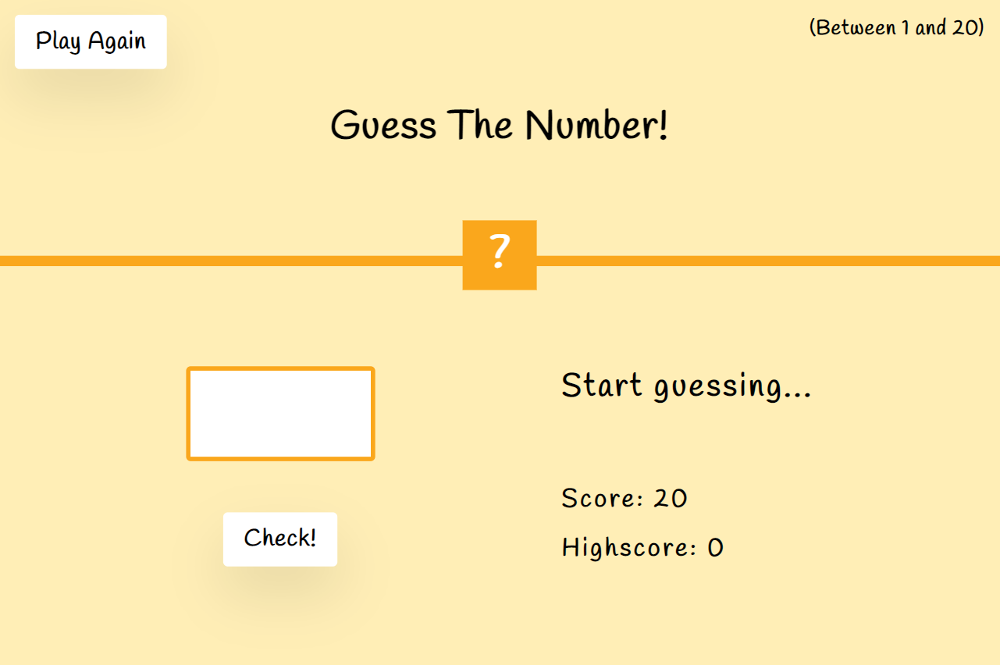
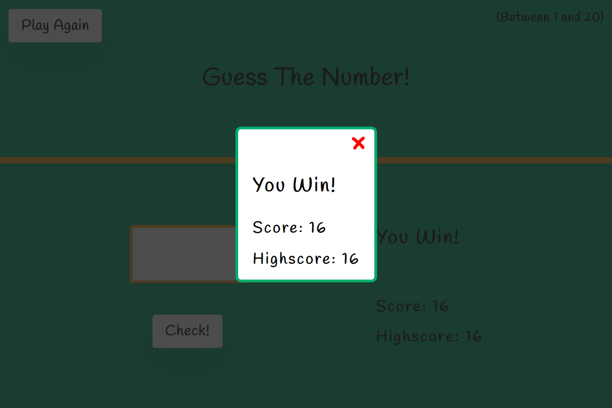
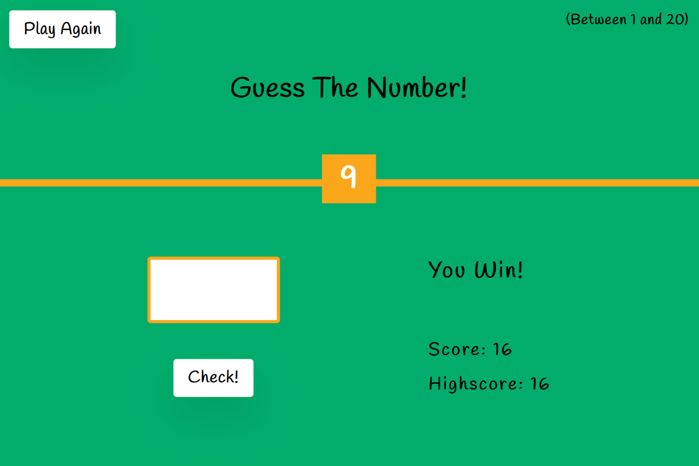
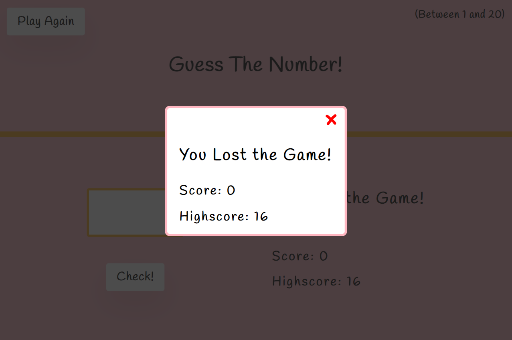
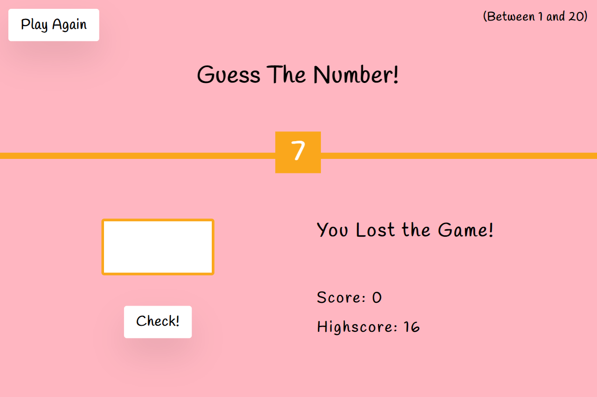

# guess-the-number

This project is a **browser-based game** created in HTML, CSS, and JS. Its created with the concept of **DOM manipulation** in JS.

## game description

When the game starts, a secret random number is generated. That secret number is in the range of 1 - 20. And the player has to guess that secret number.

At the start, a player has a score of 20 points. On each wrong guess, the score is decremented by 1.

:white_check_mark: **win condition** : player guessed the number
:x: **loss condition** : score becomes zero

## technical point

Each time the game starts, the **high score** is fetched from the **browser's local storage** if the high score exists.

And when a player scores a high score then that score is stored in the browser's local storage.

## screens

### main screen

### win screens

### loss screens

## site link

By [Clicking Me](https://msarmadqadeer.github.io/guess-the-number/) you'll see the live version of this project. If you like the project, star ⭐ the repo!
